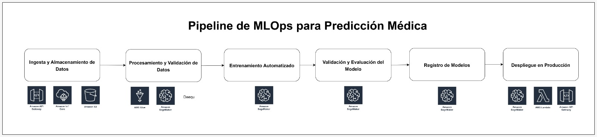

# Pipeline de MLOps para Predicción de Enfermedades

## 1. Diseño

### Restricciones y Limitaciones:
- **Datos limitados para enfermedades huérfanas:** Existe escasez de datos para estas enfermedades, lo que puede comprometer la precisión del modelo.
- **Desbalance de clases:** Las enfermedades comunes están sobrerrepresentadas en los datos.
- **Privacidad de datos:** Es obligatorio cumplir con regulaciones como HIPAA o GDPR.

### Tipos de Datos:
- Datos clínicos (síntomas, historial médico).
- Resultados de laboratorio.
- Etiquetas de enfermedades (comunes y raras).

## 2. Desarrollo

### Fuentes de Datos:
- Historiales médicos de hospitales y centros clínicos.
- Bases públicas o consorcios de enfermedades raras.
- Simulación o augmentación de datos para enfermedades huérfanas.

### Modelos:
- Modelos supervisados (Regresión logística, Random Forest, XGBoost).
- Transferencia de aprendizaje para enfermedades raras.
- Técnicas para manejar desbalance de clases (SMOTE, focal loss).

### Validación:
- Validación cruzada.
- Métricas: Accuracy, F1-Score, AUC, recall por clase.

## 3. Producción

### Despliegue:
- API REST para exponer el modelo.
- Docker para portabilidad.
- SageMaker Endpoint o Lambda para escalabilidad.

### Monitoreo:
- Seguimiento de métricas del modelo (latencia, precisión, drift).
- Alarmas automáticas ante caída de rendimiento.

### Reentrenamiento:
- Nuevos datos se incorporan de forma programada.
- Pipelines automatizados para reentrenar y desplegar versiones mejoradas del modelo.

---

## Diagrama del Pipeline

---

## Tabla de Etapas y Herramientas

| Etapa                                    | Descripción breve                                                                 | Herramientas AWS                             | ¿Para qué se usan estas herramientas? |
|------------------------------------------|-----------------------------------------------------------------------------------|-----------------------------------------------|---------------------------------------|
| **1. Ingesta y Almacenamiento de Datos** | Captura de datos clínicos y almacenamiento seguro en bruto.                      | **Amazon API Gateway** **AWS IoT Core** **Amazon S3** | - **API Gateway**: Recibe datos desde apps móviles o portales médicos.  - **IoT Core**: Ingesta desde dispositivos médicos conectados.  - **S3**: Almacena los datos crudos o estructurados. |
| **2. Procesamiento y Validación**        | Limpieza, transformación y control de calidad.                                   | **AWS Glue** **Amazon SageMaker Processing** **Deequ** | - **Glue**: ETL serverless para transformar y preparar datos.  - **SageMaker Processing**: Corre notebooks o scripts de preprocesamiento.  - **Deequ**: Verifica la calidad, unicidad y consistencia de los datos. |
| **3. Entrenamiento Automatizado**        | Entrena modelos al recibir nuevos datos.                                         | **Amazon SageMaker (Training Jobs)**           | - Lanza entrenamientos automáticamente con nuevos datasets, parametrizados y reproducibles. |
| **4. Validación y Evaluación del Modelo**| Evalúa el modelo con métricas adecuadas y comparaciones con versiones previas.   | **Amazon SageMaker Experiments**               | - Organiza pruebas de entrenamiento, captura métricas, compara versiones de modelos fácilmente. |
| **5. Registro de Modelos**               | Almacena, versiona y aprueba modelos entrenados.                                 | **Amazon SageMaker Model Registry**            | - Gestiona el ciclo de vida del modelo: versiones, permisos, etiquetas de aprobación para producción. |
| **6. Despliegue en Producción**          | Publica el modelo como API para predicciones en tiempo real.                     | **Amazon SageMaker Endpoint** **AWS Lambda** **API Gateway** | - **SageMaker Endpoint**: Crea un endpoint escalable para inferencia.  - **Lambda**: Lógica intermedia ligera para pre/post-procesamiento.  - **API Gateway**: Expone el endpoint como API segura. |
| **7. Monitoreo del Modelo**              | Evalúa el rendimiento del modelo desplegado.                                     | **Amazon CloudWatch** **SageMaker Model Monitor** | - **CloudWatch**: Monitorea logs, latencia, uso de recursos.  - **Model Monitor**: Detecta drift de datos o desempeño y genera alertas. |
| **8. Reentrenamiento Automático**        | Vuelve a entrenar el modelo cuando baja el rendimiento o hay nuevos datos.       | **EventBridge** **Step Functions** **SageMaker Pipelines** | - **EventBridge**: Lanza reentrenamiento cuando se detectan eventos.  - **Step Functions**: Orquesta pasos del pipeline.  - **Pipelines**: Automatiza el flujo completo desde procesamiento hasta despliegue. |

---

Este pipeline es modular, escalable y cumple con las buenas prácticas de MLOps. Está diseñado para permitir tanto el desarrollo rápido de prototipos como la operación robusta en producción. La automatización del reentrenamiento y monitoreo continuo garantizan que el modelo se mantenga actualizado y confiable con el tiempo.
